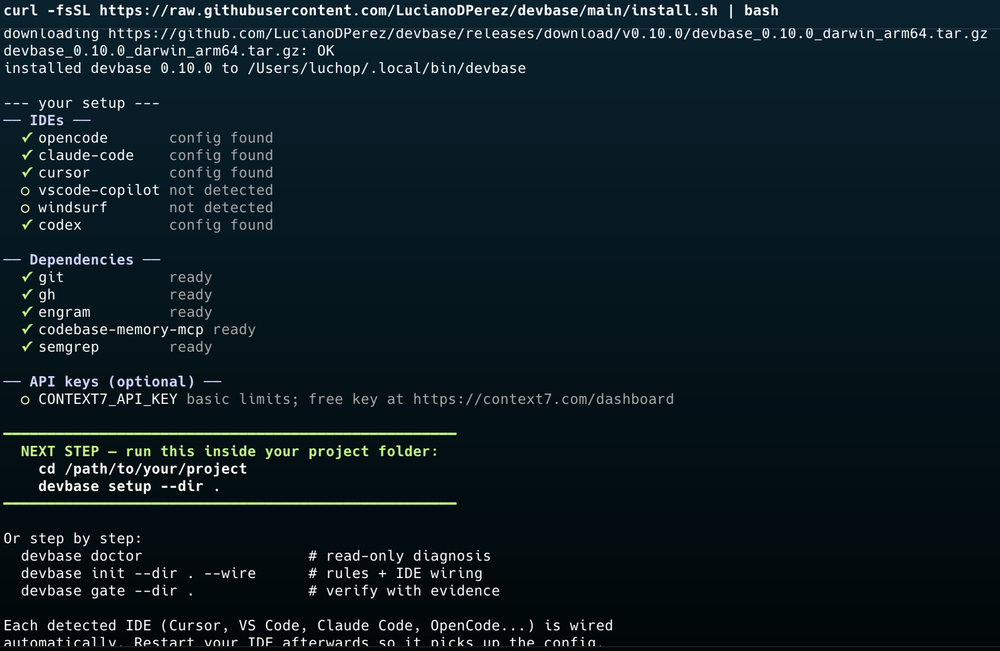
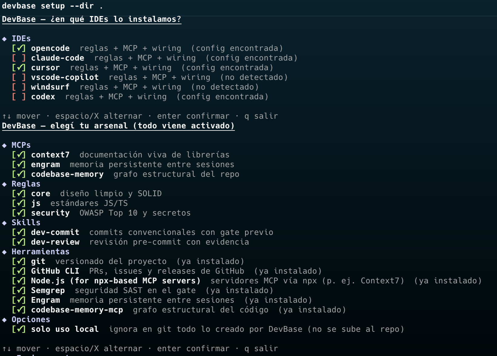
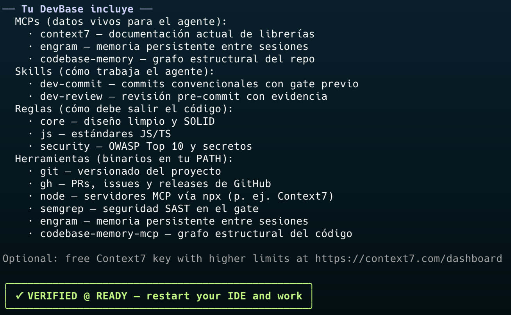

# DevBase

**Un solo comando que deja a cualquier dev con el arsenal completo: herramientas probadas, reglas contextuales y verificación con evidencia — en su SO y su IDE.**

```bash
curl -fsSL https://raw.githubusercontent.com/LucianoDPerez/devbase/main/install.sh | bash
cd tu-proyecto
devbase setup --dir .
```

## El problema

Cada dev pierde días en lo mismo: buscar qué MCPs instalar, copiar reglas sueltas de internet, pelearse con configs distintas por IDE (Cursor usa una clave, VS Code otra, Codex TOML), y encima el agente alucina APIs y declara "listo" sin pruebas. DevBase ataca las tres cosas de raíz.

## Qué hace por vos

1. **Instala** lo que falta según tu sistema (brew/apt/dnf/pacman/winget): `gh`, Node, Semgrep, Engram, codebase-memory — o te dice exactamente dónde conseguirlo si no hay receta automática.
2. **Detecta tu stack** (PHP/Laravel, React/Next, Python/Django, Go, Rust, Ruby, Java, C#, Kotlin, Swift, Flutter y más) y escribe solo las reglas que aplican, en el formato nativo de cada IDE.
3. **Configura tus IDEs** (OpenCode, Claude Code, Cursor, VS Code + Copilot, Windsurf, Codex): MCPs, reglas y skills, con backup de todo lo previo.
4. **Verifica con evidencia**: el gate corre la suite de tests del proyecto (`go test`, `npm test`, `pytest`, PHPUnit, `cargo test`…), build, análisis estático, Semgrep y E2E cuando hay specs — y emite `VERIFIED`, `BLOCKED` o `INCOMPLETE`, nunca un "creo que está bien".



## El catálogo

Al correr `setup` elegís de un catálogo curado — todo activado por default, espacio para quitar:



Al final, el reporte te dice qué hace cada pieza:



## Casos de uso

- **Onboarding en 5 minutos**: clonás un repo, corrés `setup`, y tu agente ya conoce el stack, las convenciones y la memoria del proyecto.
- **Pre-commit real**: `devbase gate --dir .` bloquea si hay un error de tipos, un hallazgo de seguridad o tests rotos — con la evidencia exacta.
- **Equipos**: las reglas viven en el repo (`CLAUDE.md`, `AGENTS.md`, `.cursor/rules`…), así todos los agentes trabajan igual. O activá *solo uso local* y nada se sube a git.
- **CI**: `devbase gate --json` emite el envelope `devbase.evidence.v1` (commit + working-tree hash + toolchain + checks) para PRs y pipelines.

## Instalación y uso

```bash
# macOS / Linux
curl -fsSL https://raw.githubusercontent.com/LucianoDPerez/devbase/main/install.sh | bash

# Windows (PowerShell)
irm https://raw.githubusercontent.com/LucianoDPerez/devbase/main/install.ps1 | iex
```

Verifican SHA-256 contra `checksums.txt` del release. Desde fuente: `go build -o devbase ./cmd/devbase` (Go 1.25+).

```bash
cd tu-proyecto
devbase setup --dir .              # bootstrap completo e interactivo
devbase setup --dir . --yes        # sin preguntas (CI, scripts)
devbase doctor                     # diagnóstico de solo lectura
devbase gate --dir .               # VERIFIED / BLOCKED / INCOMPLETE (exit 0/1/2)
```

## API keys opcionales

Ninguna es obligatoria. `CONTEXT7_API_KEY` sube los límites de Context7 (gratis en https://context7.com/dashboard). `devbase doctor` te avisa si falta.

## Estado y roadmap

`v0.11.x`: setup interactivo, 25 packs de reglas, gate estricto con evidencia JSON, instaladores con checksum, CI con tests + Semgrep.

Siguiente: profiles de verificación por stack (PHPUnit/PHPStan/Pint, pytest/ruff, cargo clippy…), tests del proyecto dentro del gate, adapters Cline/Roo/Kilo/Continue.

## Contribuir

Ver [CONTRIBUTING.md](CONTRIBUTING.md). Commits convencionales, sin atribución IA. Reportes de seguridad por GitHub Security Advisories ([SECURITY.md](SECURITY.md)).
